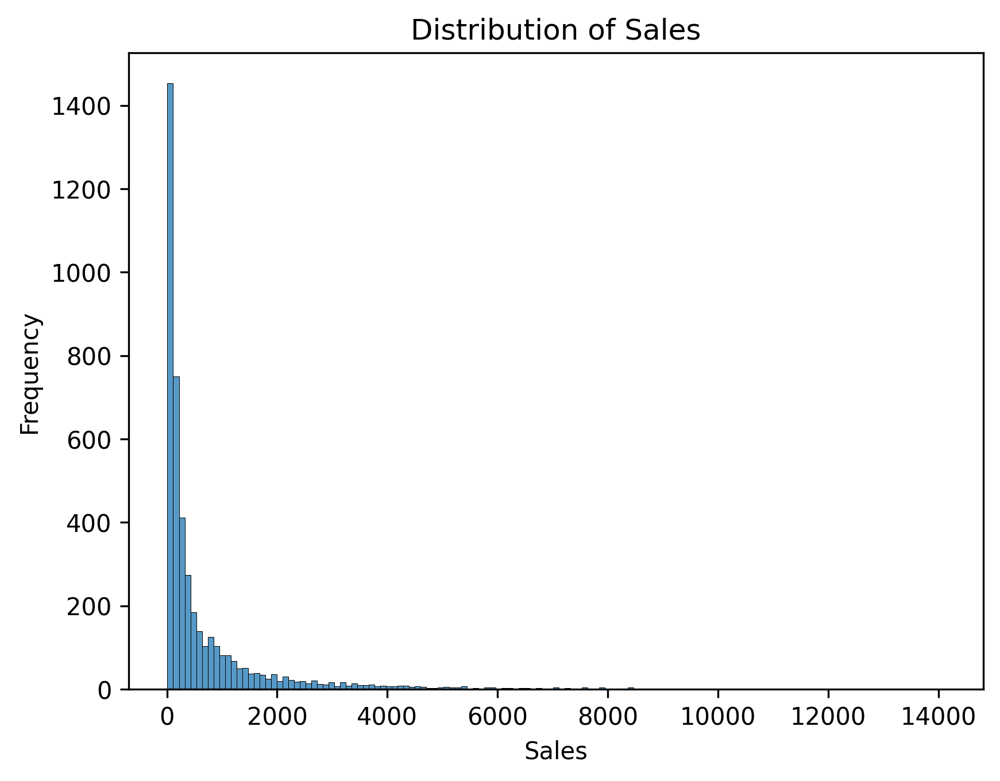
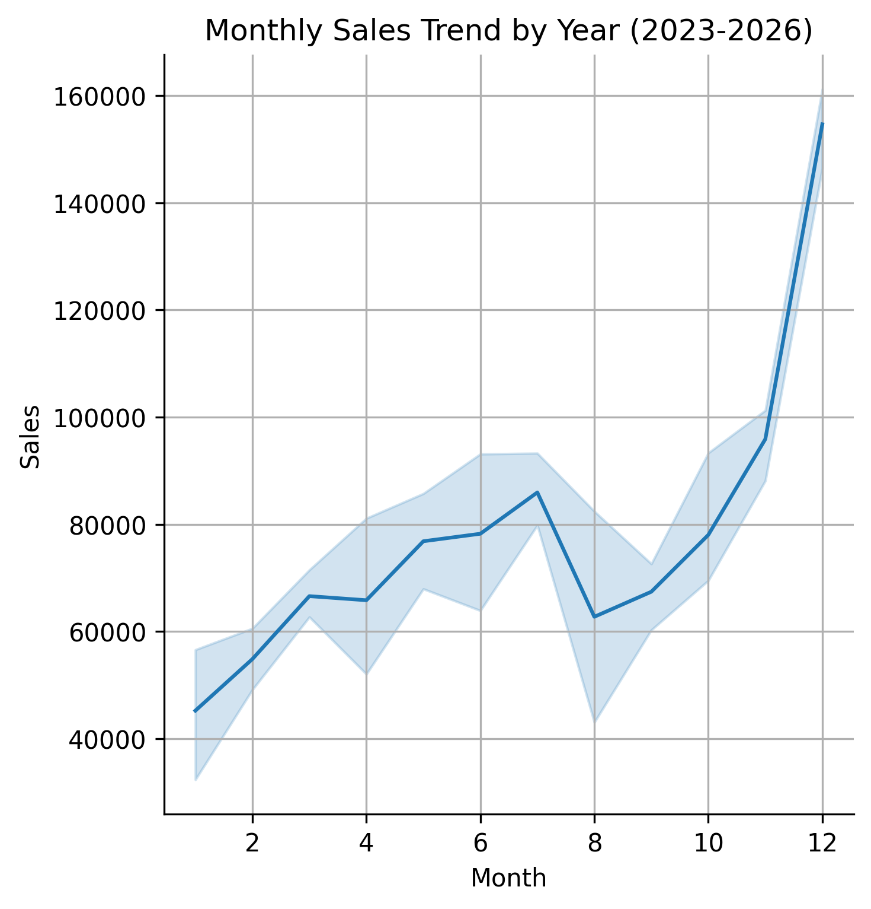
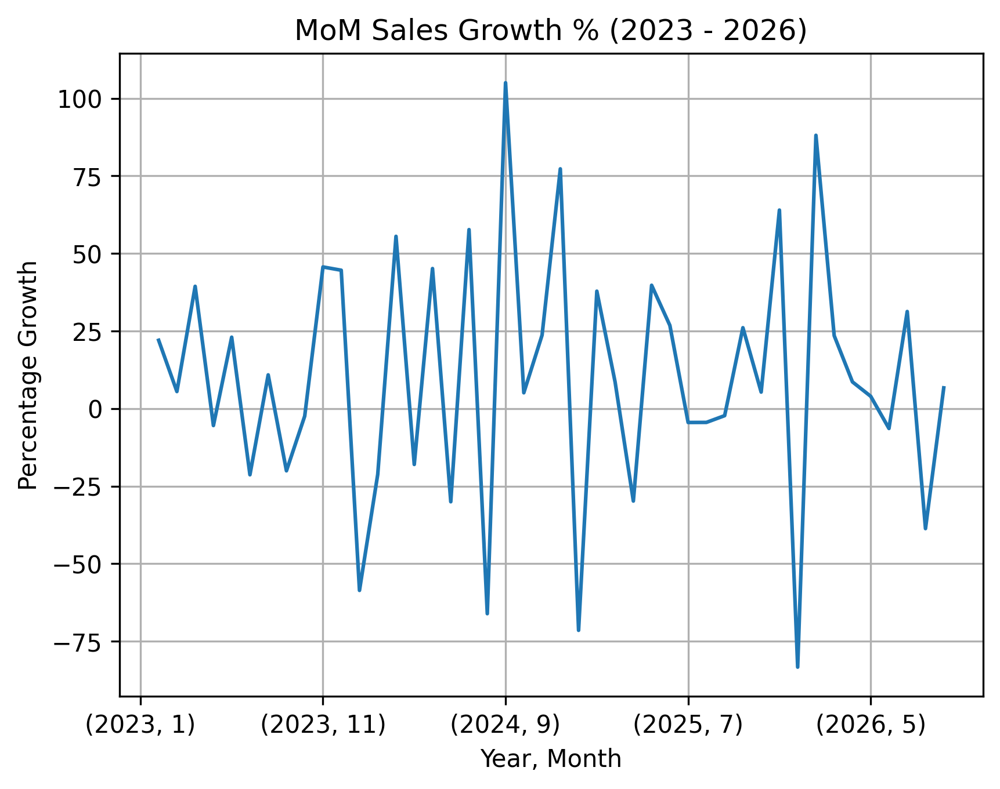
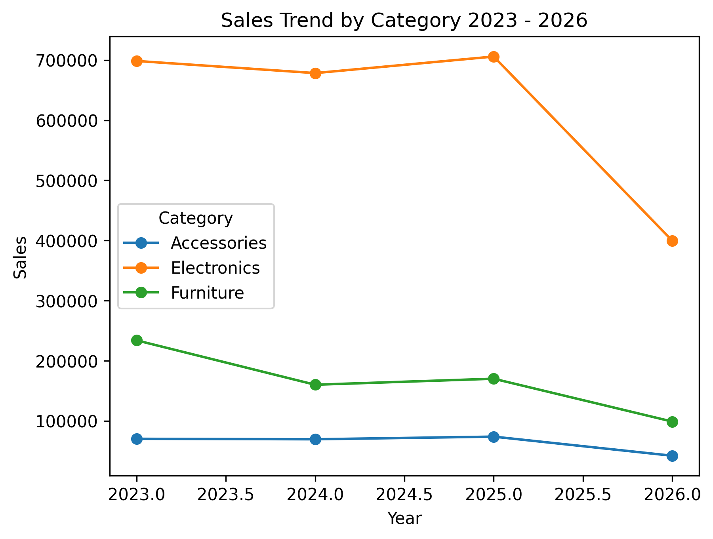
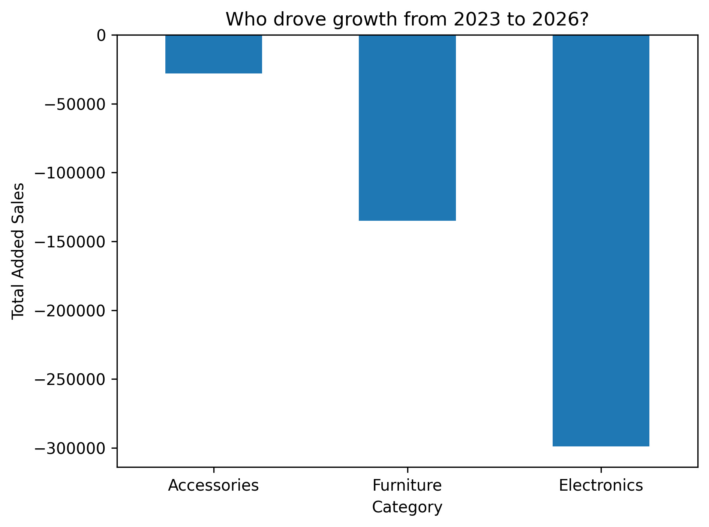
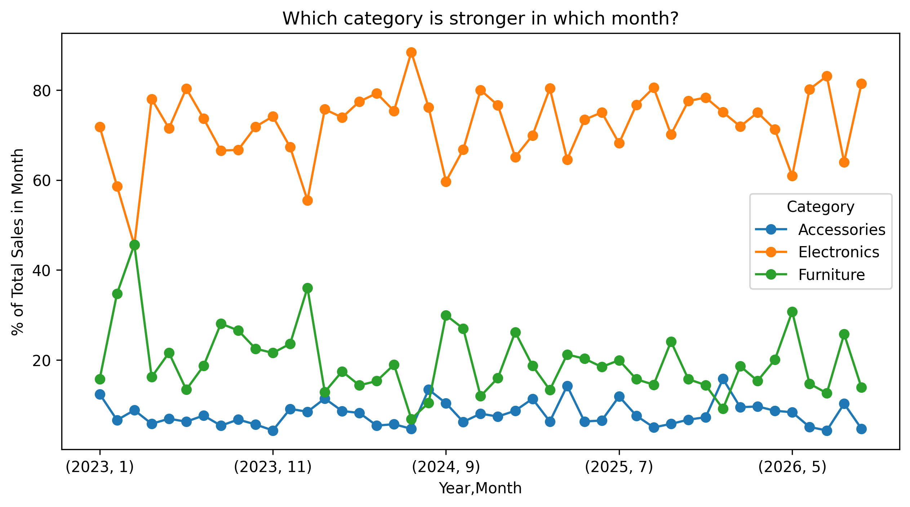
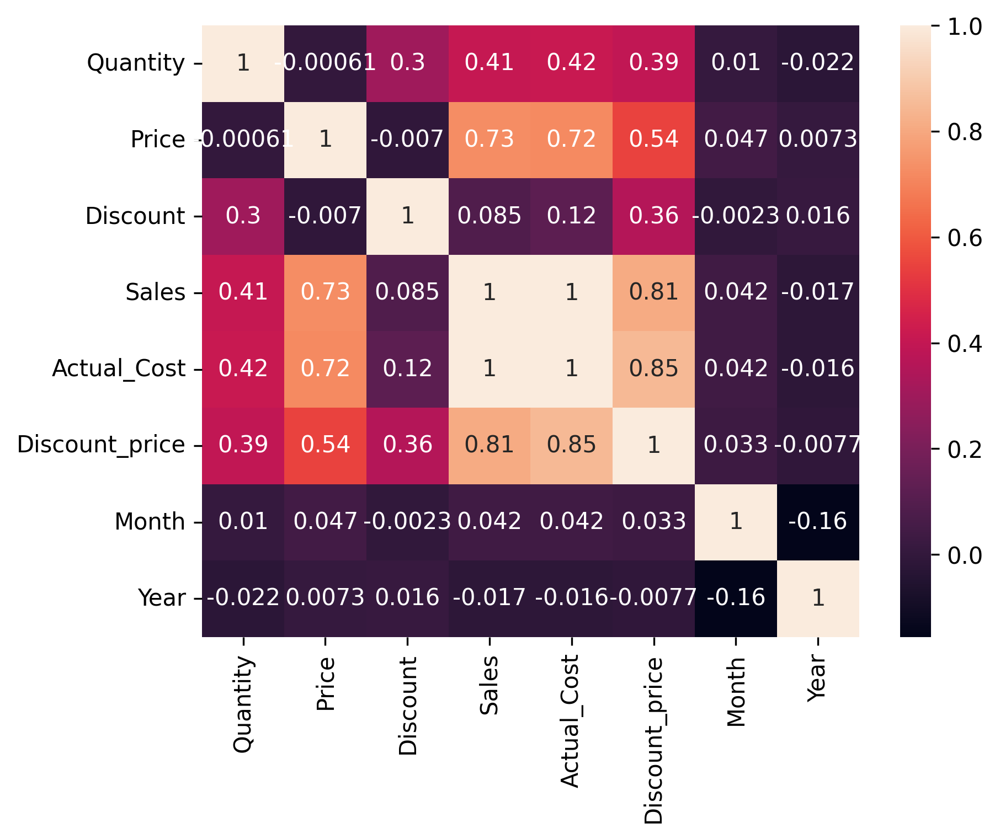

# 📊 Ghana Retail Sales Analysis (2023–2026)


## 📌 Project Overview

An end-to-end exploratory data analysis of 4,500 retail transactions across Ghana (Jan 2023 – Sep 2026). The project cleans and validates raw sales data, then uncovers revenue trends, category performance, regional patterns, and seasonality to answer key business questions a retail stakeholder would ask.

## ❓ Business Questions Answered

- Which product categories and products generate the most revenue?
- How do sales trend over time, and is the business growing or declining?
- Which months are strongest/weakest, and does seasonality repeat every year?
- How does performance differ by region, customer type, and payment method?
- Is the underlying transaction data accurate and internally consistent?

## 🗂️ Dataset Description

**File:** `retail_sales_4500_ghana.csv` &nbsp;•&nbsp; **Shape:** 4,500 rows × 11 columns &nbsp;•&nbsp; **Period:** Jan 2023 – Sep 2026

| Column | Description |
|---|---|
| `Date` | Transaction date |
| `Customer_ID` | Unique customer identifier |
| `Customer_Type` | Retail or Wholesale |
| `Region` | One of 8 Ghanaian regions (Greater Accra, Ashanti, Central, Eastern, Western, Northern, Volta, Bono) |
| `Payment_Method` | Card, Cash, Mobile Money, or Bank Transfer |
| `Category` | Electronics, Furniture, or Accessories |
| `Product` | Specific product sold (15 unique products, e.g. Laptop, Smartphone, Desk) |
| `Quantity` | Units sold |
| `Price` | Unit price |
| `Discount` | Discount rate applied |
| `Sales` | Net revenue for the transaction |

No missing values or duplicate rows were found in the raw dataset.

## 🛠️ Tools & Libraries

| Tool | Purpose |
|---|---|
| Python | Core programming language |
| Pandas | Data cleaning, aggregation, groupby analysis |
| NumPy | Numerical operations, `np.isclose()` consistency checks |
| Matplotlib | Chart plotting |
| Seaborn | Statistical visualizations & heatmaps |
| Jupyter Notebook | Interactive analysis environment |

## 🔍 Project Workflow / Methodology

1. **Data Cleaning** — Loaded and reordered columns, checked dtypes, scanned for missing values and duplicate rows, and reviewed categorical/numerical column ranges.
2. **Data Validation** — Engineered `Actual_Cost` and `Discount_price` fields and used `np.isclose()` for cross-field validation, confirming all 4,500 transactions were mathematically consistent (0 discrepancies). Checked for outliers using the IQR method.
3. **Exploratory Data Analysis** — Computed summary statistics and groupby aggregations (totals, averages, transaction counts) by Product, Category, Region, and Customer Type.
4. **Time-Series Analysis** — Converted `Date` to datetime, extracted `Year`/`Month`, and analyzed daily/monthly sales, month-over-month growth %, and year-over-year category trends.
5. **Visualization** — Built trend lines, bar charts, a category-strength heatmap, and share-of-sales plots to surface patterns.
6. **Insights** — Synthesized findings into actionable business takeaways (below).

## 📈 Key Visualizations

> Export each chart from the notebook and save it into the `images/` folder using the filenames referenced below.

| Visualization | Description |
|---|---|
|  | Histogram showing the distribution of individual transaction values. |
|  | Monthly sales trend by year (2023–2026), highlighting the recurring December peak. |
|  | Month-over-month sales growth % across the full 2023–2026 period. |
|  | MoM growth % faceted by year, making it easy to compare seasonality across 2023–2026 side by side. |
|  | Yearly sales trend by category (2023–2026), showing each category's trajectory over time. |
|  | Bar chart of total sales change from 2023 to 2026 by category, showing which categories drove the overall decline. |
|  | Each category's share (%) of total monthly sales, showing which category is strongest in which month. |
|  | Heatmap of correlations between numeric fields (Quantity, Price, Discount, Sales). |

## 💡 Key Insights & Findings

- **Electronics dominates revenue**, contributing ~73% of total sales (GHS 2.48M of GHS 3.4M), led by Laptop and Smartphone as the top two revenue-generating products.
- **December is consistently the strongest month** every year (peaking at GHS 161K in Dec 2025), while January is consistently the weakest — a clear, repeatable seasonal pattern likely tied to holiday shopping.
- **Overall revenue has declined from 2023 to 2026**, with Electronics driving the largest drop (‑GHS 299K), followed by Furniture (‑GHS 135K) and Accessories (‑GHS 28K), signaling a category-wide slowdown rather than an isolated issue.
- **Greater Accra is the clear regional leader**, generating ~40% of total revenue (GHS 1.35M) and the highest transaction volume, making it the priority market for retention efforts.
- **Wholesale customers spend far more per transaction** (median ≈ GHS 506) than Retail customers (median ≈ GHS 189), despite placing fewer orders — suggesting wholesale accounts are a high-value segment worth nurturing.
- **Data quality is strong**: all 4,500 transactions passed `np.isclose()` cross-field validation with zero inconsistencies and no missing or duplicate records.

## ▶️ How to Run This Project Locally

1. **Clone the repository**
   ```bash
   git clone https://github.com/<your-username>/ghana-retail-sales-analysis.git
   cd ghana-retail-sales-analysis
   ```

2. **Install dependencies**
   ```bash
   pip install pandas numpy matplotlib seaborn jupyter
   ```

3. **Create the images folder** (used to store exported chart images)
   ```bash
   mkdir -p images
   ```

4. **Launch the notebook**
   ```bash
   jupyter notebook Analysis.ipynb
   ```

## 📁 Folder Structure

```
ghana-retail-sales-analysis/
│
├── data/
│   └── retail_sales_4500_ghana.csv
│
├── images/
│   ├── sales_distribution.png
│   ├── monthly_sales_trend.png
│   ├── mom_sales_growth.png
│   ├── mom_growth_by_year.png
│   ├── category_trend_yearly.png
│   ├── category_growth_drivers.png
│   ├── category_monthly_share.png
│   └── correlation_heatmap.png
│
├── Analysis.ipynb
├── README.md
└── requirements.txt
```

## 🚀 Future Improvements

- Add a proper `Sub-Category` field or map products into finer sub-groups for deeper category analysis.
- Build an interactive dashboard (Plotly Dash / Streamlit / Power BI) for stakeholders to explore filters by region and time period.
- Incorporate customer-level RFM (Recency, Frequency, Monetary) segmentation.
- Add statistical/time-series forecasting (e.g. ARIMA, Prophet) to predict future sales.
- Investigate the 2023–2026 revenue decline further with cohort or churn analysis to identify root causes.

---
⭐ If you found this project useful, consider giving it a star on GitHub!
